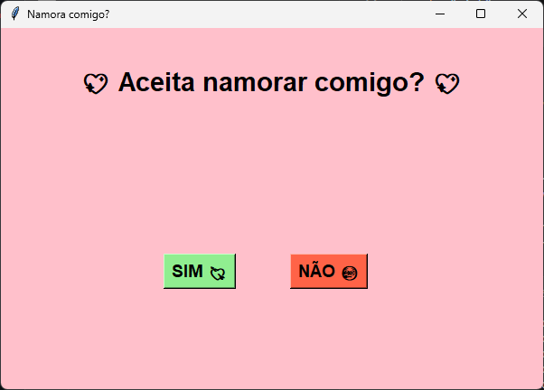

💖 Pedido de Namoro em Python

Um projeto simples e divertido feito em Python usando tkinter.
A ideia é criar uma janela com a pergunta:
Você aceita namorar comigo?
O botão SIM abre um link especial no navegador.
O botão NÃO foge quando o mouse chega perto.

📌 Funcionalidades
Interface rosa personalizada
Botão "SIM" funcional
Botão "NÃO" que foge do mouse
Projeto leve e divertido
Fácil de modificar
Feito apenas com Python

📷 Preview

🚀 Tecnologias usadas
Python
Tkinter
Random
Webbrowser

  

🎮 Como executar
Clone o repositório:
Entre na pasta:
cd seu-repositorio
Execute:
python pedido.py

📌 Funcionalidades
Interface fofa em rosa
Botão "SIM" funcional
Botão "NÃO" que foge do mouse
Fácil de modificar
Feito apenas com Python
💻 Arquivo principal
pedido.py
❤️ Objetivo
Esse projeto foi criado para praticar Python de uma forma divertida e criativa.
📄 Licença
Livre para uso e modificação.

